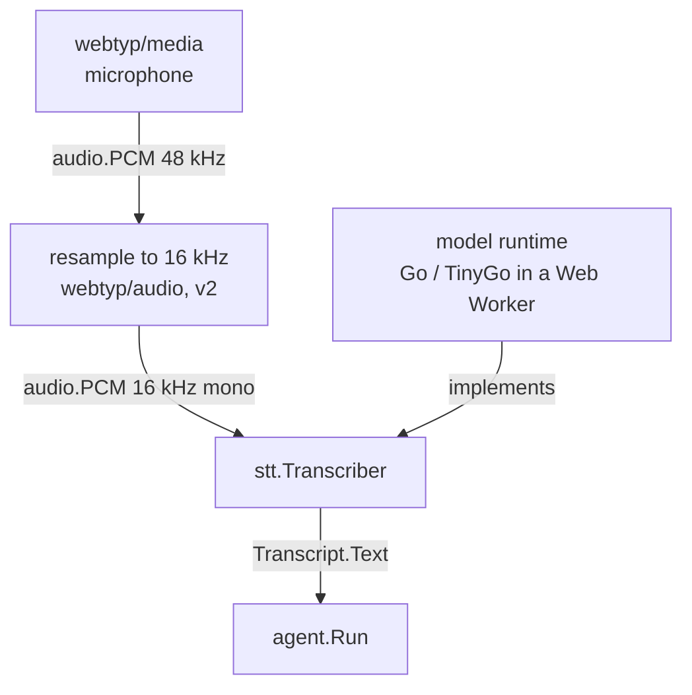

# Architecture — `webtyp/stt`

## What this is

The **speech-to-text** contract: an interface that turns recorded speech (`audio.PCM`) into a
`Transcript`. It is also called automatic speech recognition (ASR).

You meet it in version 2 of the webtyp agent. The person talks, and the transcript goes to
`agent.Run` exactly as if it had been typed. Version 1 is text only, and the contract exists
now so the pipeline is wired from the start.

It exists as a contract, separate from any model, so that the application and the agent do
not change when the model does.

## The model that will implement it (version 2, open)

The implementation runs **in the browser, in Go compiled with TinyGo, inside a Web Worker**,
the same way `webtyp/embed` runs the embedding model. It reuses the existing pieces where the
model allows:

| Existing piece | Reused for |
|---|---|
| `webtyp/weightsc` + `webtyp/weights` | converting and loading the model's weights (int8 with per-row scales) |
| `webtyp/transformer` kernels (matmul, attention, norms, RoPE) | the encoder and decoder of transformer-based STT models |
| `webtyp/tokenizer` | turning the decoder's token ids back into text |

This reuse is why the choice between candidates is not only about accuracy.
[SPEECH_TO_TEXT_BROWSER_MODELS.md](SPEECH_TO_TEXT_BROWSER_MODELS.md) compares Moonshine,
Zipformer (sherpa-onnx) and Whisper. Its runtime recommendations (transformers.js, ONNX
Runtime Web) assume JavaScript, and webtyp does not use that route. What carries over is the
model comparison:

- **Moonshine** is an encoder-decoder transformer with no 30-second padding. Its shape matches
  what `transformer` already computes, plus the decoder the LLM runtime also needs.
  **To verify:** Spanish support and licence of the Spanish weights. The original Moonshine
  releases are English-only.
- **Zipformer** is a transducer built from convolutions. It is the best fit for word-by-word
  streaming, but most of its operators do not exist in `transformer` yet.
- **Whisper tiny/base** is multilingual (Spanish included) and MIT licensed, but it pays for
  30-second padding on every call.

The decision is taken with measurements (word error rate in Spanish, real-time factor under
TinyGo/WASM), the same method `retrieval`'s semantic-search plan used to pick the embedding
model. It is an open decision in the
[ecosystem master plan](https://github.com/webtyp/agent/blob/main/docs/AGENT_ECOSYSTEM_MASTER_PLAN.md).
